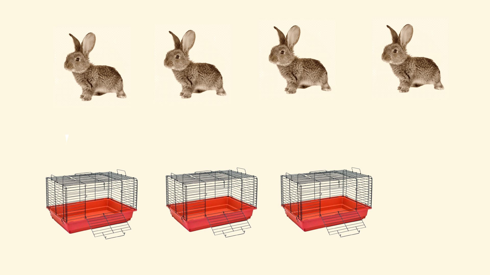
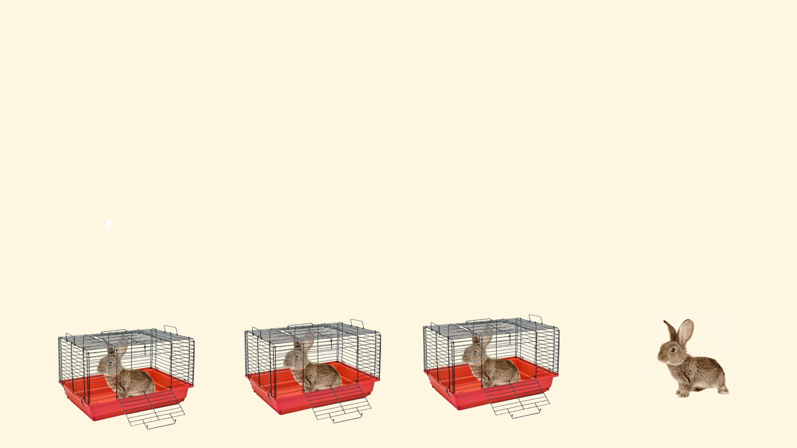

---

# Принцип дирихле

Если кролики рассажены в клетки, причём число кроликов больше числа клеток, то хотя бы в одной из клеток находится более одного кролика.

---

---

---

1. Докажите, что среди любых шести целых чисел найдутся два, разность которых кратна 5.
2. Плоскость раскрашена в два цвета. Докажите, что найдутся 2 точки на расстоянии 1 метр друг от друга, раскрашенные в один цвет.
3. Докажите, что среди любых шести человек всегда найдутся либо трое попарно знакомых, либо трое попарно незнакомых.

---

4. В ящике лежат шары: 5 красных, 7 синих и 1 зеленый. Сколько шаров надо вынуть, не глядя, чтобы наверняка достать 2 шара одного цвета?
5. В лесу растет миллион елок. Известно, что на каждой из них не более 600000 иголок.
Докажите, что в лесу найдутся две елки с одинаковым числом иголок.
6. В ковре размером 4×4 метра моль проела 15 дырок. Докажите, что из него можно вырезать коврик размером 1×1 метр, не содержащий внутри себя дырок. (Дырки считайте точечными.)

---

7. Докажите, что если 21 человек собрал 200 орехов, то есть два человека, собравшие поровну орехов.
8. Каждая клетка таблицы 2015×2015 покрашена в один из 2014 цветов. За ход можно взять строку или столбец и, если там есть две клетки одного цвета, перекрасить эту строку или столбец в этот цвет. Можно ли за несколько ходов покрасить всю таблицу в один цвет?