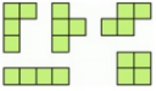

---

# Геометрия

Разрежьте квадрат 5×5 с дыркой на две равные части двумя способами. Способы разрезания квадрата на две части будем считать различными, если части квадрата, полученные при одном способе разрезания, отличаются по форме или размеру от частей, полученных при другом способе (то есть их нельзя совместить наложением).

---

- Разделите квадрат 4×4 на две равные части четырьмя различными способами так, чтобы линия разреза шла по сторонам клеток.
- Из трех — один. Дано три квадрата: 2×2, 6×6 и 9×9. Разрежьте самый большой квадрат на три части так, чтобы из полученных пяти фигур можно было сложить один квадрат.
- Можно ли квадрат 10×10 разрезать на четырёхклеточные фигурки в виде буквы Т?

---

- Можно ли из пяти фигур, изображенных на рисунке сложить прямоугольник 4×5?

---

- Пятнадцать хулиганов вышли на демонстрацию с воздушными шариками и построились в виде квадрата 3×5. По команде каждый проткнул шарик соседа (возможно двое ткнули в один). Докажите, что хотя бы один шарик остался целым.
- Можно ли доску 8×8 замостить 15-ю горизонтальными и 17-ю вертикальными прямоугольниками 1×2?

---

- Придумайте две различных раскраски, показывающие, что квадрат 10×10 нельзя разрезать на прямоугольники 1×4.
- Придумали в шахматах новую фигуру: «лягушку», которая поочередно делает ходы на 1, 2, 3, 1, 2, 3, ... клетки по вертикали или горизонтали. Может ли такая лягушка обойти всю доску 8×8 побывав в каждой клетке по одному разу?
- Из доски 11×11 вырезали 15 квадратиков 2×2 по линиям сетки. Докажите, что можно вырезать ещё один квадратик.

---

# Домашнее задание

1. Прочитать рассказ Л. Кэррола [О чём Черепаха говорила Ахиллесу](https://ru.wikisource.org/wiki/%D0%9E_%D1%87%D1%91%D0%BC_%D0%A7%D0%B5%D1%80%D0%B5%D0%BF%D0%B0%D1%85%D0%B0_%D0%B3%D0%BE%D0%B2%D0%BE%D1%80%D0%B8%D0%BB%D0%B0_%D0%90%D1%85%D0%B8%D0%BB%D0%BB%D0%B5%D1%81%D1%83_(%D0%9A%D1%8D%D1%80%D1%80%D0%BE%D0%BB%D0%BB))

2. Разрежьте прямоугольник 4×9 на две равные части и сложите
из них квадрат.

3. Нарисуйте все различные клетчатые фигуры из
    1) 4 клеток.
    2) 5 клеток.

4. Можно ли квадрат 10×10 разрезать на четырёхклеточные фигурки в виде буквы Т?