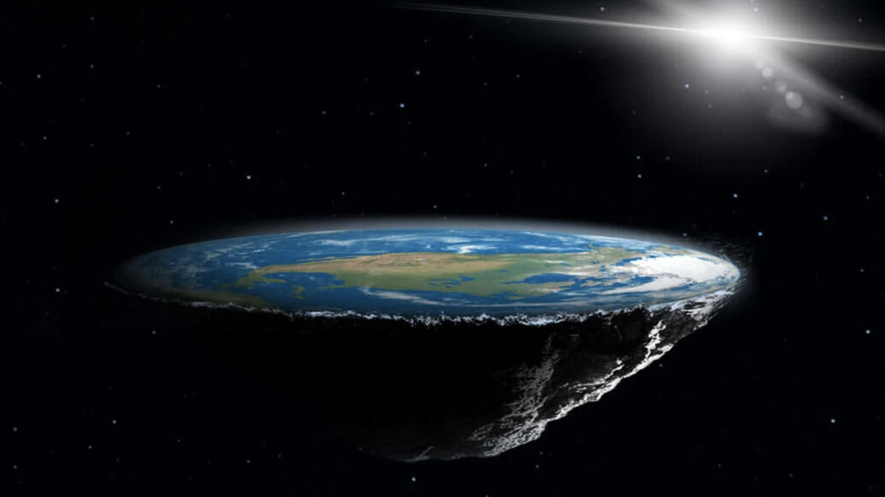

---

# Меня зовут Миша

- 5 курс ВМК МГУ
- Кафедра системного программирования
- Занимаюсь инструментарием для суперкомпьютеров

---

---

# Цели

- Расширить границы познания
- Соревнования
- Повеселиться

---

<h1 style="color:white">Какую форму имеет земля?</h1>

---

# Эпистемология

- Аристотель vs Платон
- Трансцедентализм И. Канта
- Позитивизм О. Конта
- Постпозитивизм
- Критерии К. Поппера
    1. Верифицируемость
    2. Фальсифицируемость
- Парадигмы Т. Куна