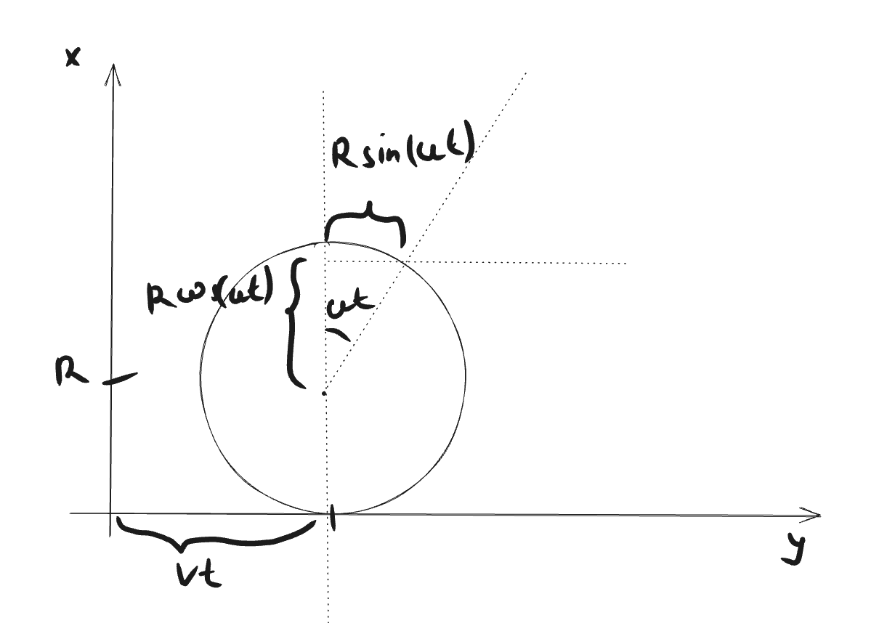

---

# Кинематика

Кинема́тика (от др.-греч. κίνημα — «движение», род. п. κινήματος) в физике — раздел механики, изучающий математическое описание (средствами геометрии, алгебры, математического анализа…) движения идеализированных тел (материальная точка, абсолютно твердое тело, идеальная жидкость), без рассмотрения причин движения (массы, сил и т. д.).

---

# Кинематика

---

# Пример

Медведь идёт к пчелиным ульям на расстояние 100 метров. Он идёт со скоростью 5 метров в минуту. Сколько времени ему потребуется, чтобы дойти до ульев?

---

# Решение

$$
v = 5\text{м/мин}
$$

$$
s = 100\text{м}
$$

$$
s = vt \implies t = \frac{s}{v} = \frac{100\text{м}}{5\text{м/мин}} = 20\text{мин}
$$

---
# Циклоида

---

# Уравнение

$$ x = vt + R \sin(\omega t) $$
$$ y = R + R \cos(\omega t) $$
$$ v = \omega R $$

---
# Задачи
1. Паром плывет по реке со скорость 30км/ч. Матрос идет по нему в противоположном направлении со скорость 5км/ч. С какой скоростью матрос движется для неподвижного наблюдателя на берегу?
2. Течение реки имеет скорость 3км/ч. Вы можете плыть со скоростью не более 5км/ч. Как переплыть на другой берег быстрее всего (построить графическое решение).
3. Определить соотношение скорости вращения Земли и Луны.

---

4. Предложите способ определить однонаправленную скорость света.
5. Лодку в озере оттолкнули от берега со скоростью 1м/с. Из-за сопротивления воды ее скорость за каждую секунду уменьшается вдвое. Оценить расстояние, которое она проплывет. Оценить время, в течение которого она будет плыть.

---

6. Physicists sometimes use the approximation that light travels in a vacuum at a speed of 1 foot in 1 ns. What is the percentage error in using this value? (1.000 m = 1.094 yards and 1.000 yard = 3.000 feet)
7. A particle moves in a straight line with an intial acceleration of 10 $m/s^{−2}$ decreases uniformly with time until, after ten seconds, the acceleration is 5 $m/s^{−2}$, and from then on the acceleration remains constant. If the intial velocity is 100 $m/s^{−1}$.
    1) Find when the velocity has doubled; 
    2) sketch a graph of the velocity against time.

---
# Домашнее задание

1. Машина едет в из Москвы в Петербург и обратно. Что быстрее, ехать в обе стороны с одинаковой скоростью, или ехать в одну сторону в 2 раза быстрее, а в другую в 2 раза медленнее?
2. Теперь мы ускоряемся и замедляемся не в 2 раза, а в k раз. Постройте в [desmos.com]() график того, во сколько раз отличается время во втором случае от первого? При каком значении k мы получим минимальное время поездки?
3. Задачи 6 и 7 с занятия