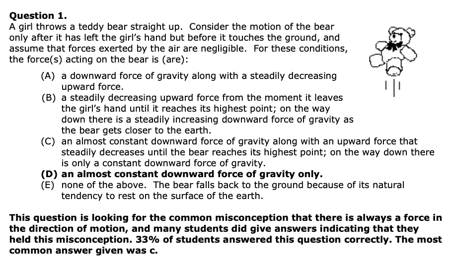
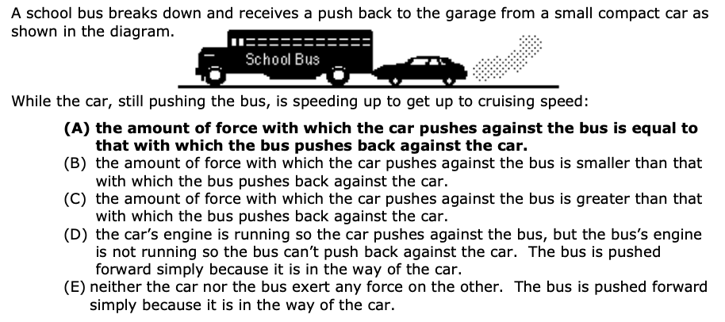

---
# Законы Ньютона

1. $$ \exists \text{ИСО} $$
2. $$ \sum \overline{F} = m\overline{a} $$
3. $$ \overline{F}_{1,2} = -\overline{F}_{2,1} $$

---
1. 

---

2. 

---

3. Сережа участвует в беге через препятствия. Чему равен его вес когда он перепрыгивает через препятствие?

4. Витя подбрасывает баскетбольный мяч вверх. Опишите силы, действующие на мяч на протяжении всех траектории.

---

# Домашнее задание

1. На столе лежит телефон. **Нарисуйте** силы, действующие на него.

2. Почему когда автобус тормозит, пассажиры падают вперед?

3. Витя подбросил мяч в воздух. Мяч пробыл в полете 2 секунды. С какой скоростью Витя подбросил мяч? Какая была скорость мяча, когда Витя его поймал?

---

4. В программе desmos.com постройте траекторию полета пули выпущенной под углом к горизонту и линию, на которой находятся все верхние точки полета для различных начальных углов. При каком угле достигается максимальная высота полета? А дальность?
